<h1 align="center">LaTeX Live</h1>
<p align="center">Read and write LaTeX projects in Obsidian, with live math, proof references and native PDF preview.</p>

<p align="center">
  <a href="https://github.com/qiulinfan/obsidian-latex-live/commits/main"></a>
  <a href="https://github.com/qiulinfan/obsidian-latex-live/stargazers"></a>
  <a href="https://github.com/qiulinfan/obsidian-latex-live/releases/latest"></a>
  <a href="./LICENSE"></a>
  
</p>

<p align="center"><b>English</b> | <a href="./README_zh-CN.md">简体中文</a></p>

## Edit, see the PDF, jump back

Change a formula and watch the native PDF update. Then move from your cursor to the PDF, or double-click the PDF to return to the source—even across chapter files.

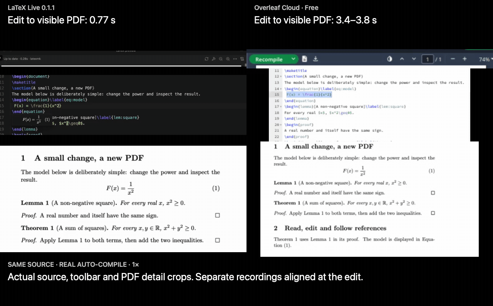

Three warm edits of the same one-page document: **LaTeX Live 0.1.1 ≈ 0.87 s** median to the new PDF; **Overleaf Cloud Free ≈ 3.7–4.1 s** observed median interval. Both use pdfLaTeX / TeX Live 2026. The local run includes the default 400 ms delay and uses the preamble cache. These are this machine/account's measured editing workflows; [source, all samples and recording method](./docs/demo/same-source-speed.en.md) are included.

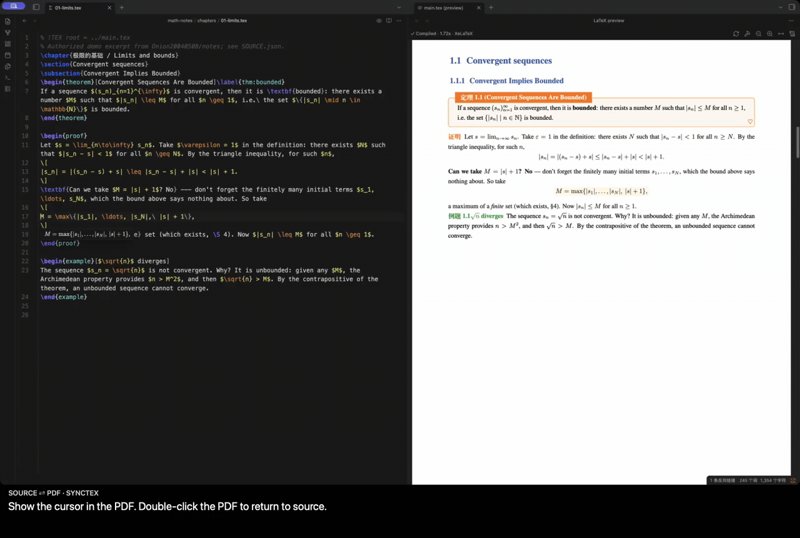

## Read and edit your template

Keep the original `.tex` project and its class. Read formulas, numbered theorem blocks and references in place; touch a formula to edit its source, then continue reading. The PDF keeps the template's native layout.

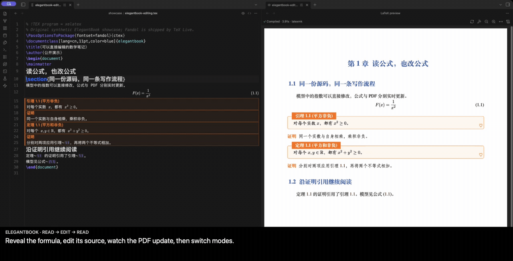

ElegantBook is one example. The same editing flow is recorded with **AMS** and **IEEE** paper classes; the gallery also shows **PLOS** and **REVTeX**. Other tested templates include Springer Nature, AASTeX, LNCS and ACM. Unsupported constructs keep their source or use a supported TeX/PDF fallback. See [the tested compatibility scope](./docs/template-compatibility.md).

<details>
<summary>Watch AMS / IEEE editing and PLOS / REVTeX live reading</summary>

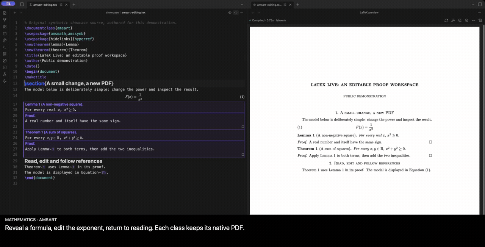

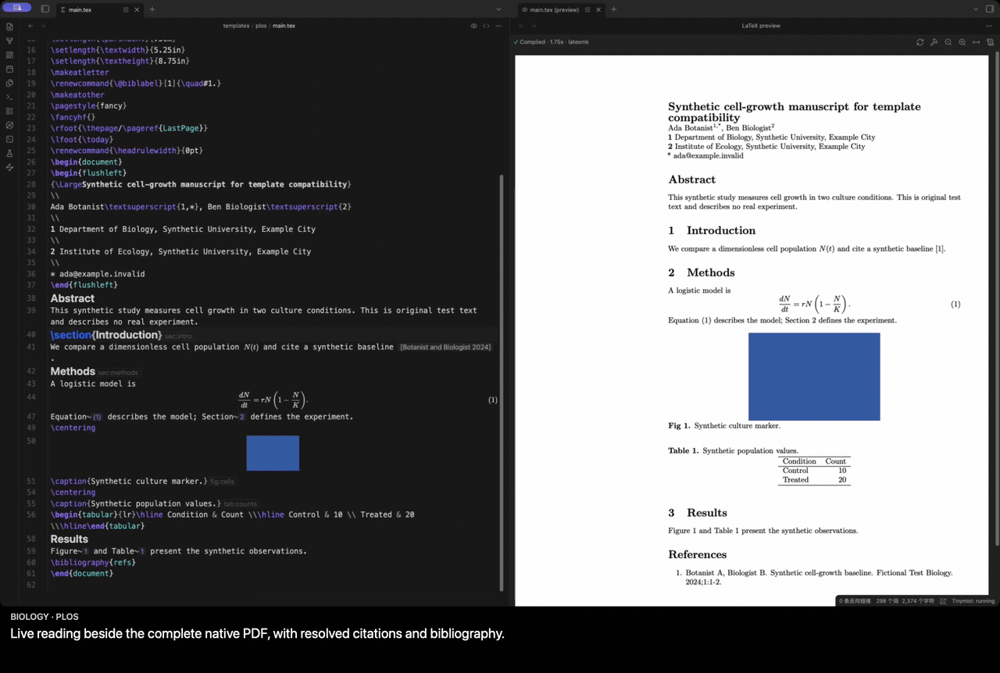

The AMS / IEEE clips contain actual edits. PLOS / REVTeX show prepared complete builds in live reading mode; they are template examples, not cold-build benchmarks.

</details>

## Hover a reference, follow a proof

Hover a theorem reference to open its proof-reference graph in a small window. Click a node to expand its statement and proof, follow another reference, or open the exact source location.

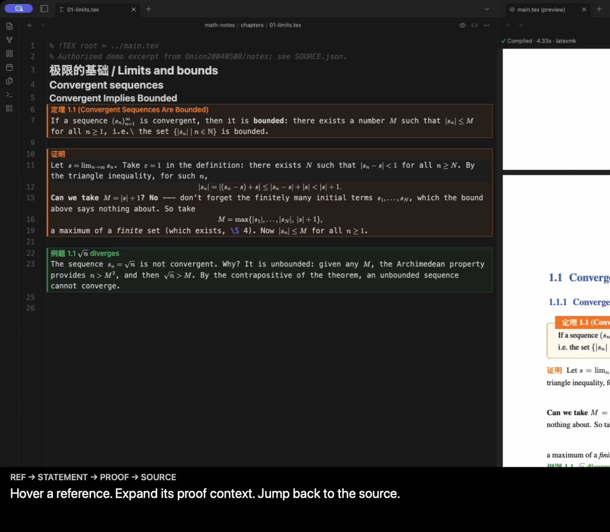

The graph comes from literal `\ref` calls in proofs within the current LaTeX project. It describes explicit proof references; it does not certify logical dependencies.

## More of the writing workflow

<details>
<summary>Formula previews, snippets, YOLO, TeX figures, diagnostics and HTML export</summary>

### Preview the formula you are typing

Project macros and equation numbers appear in hover/cursor previews. This immediate math rendering is separate from generating the complete PDF.

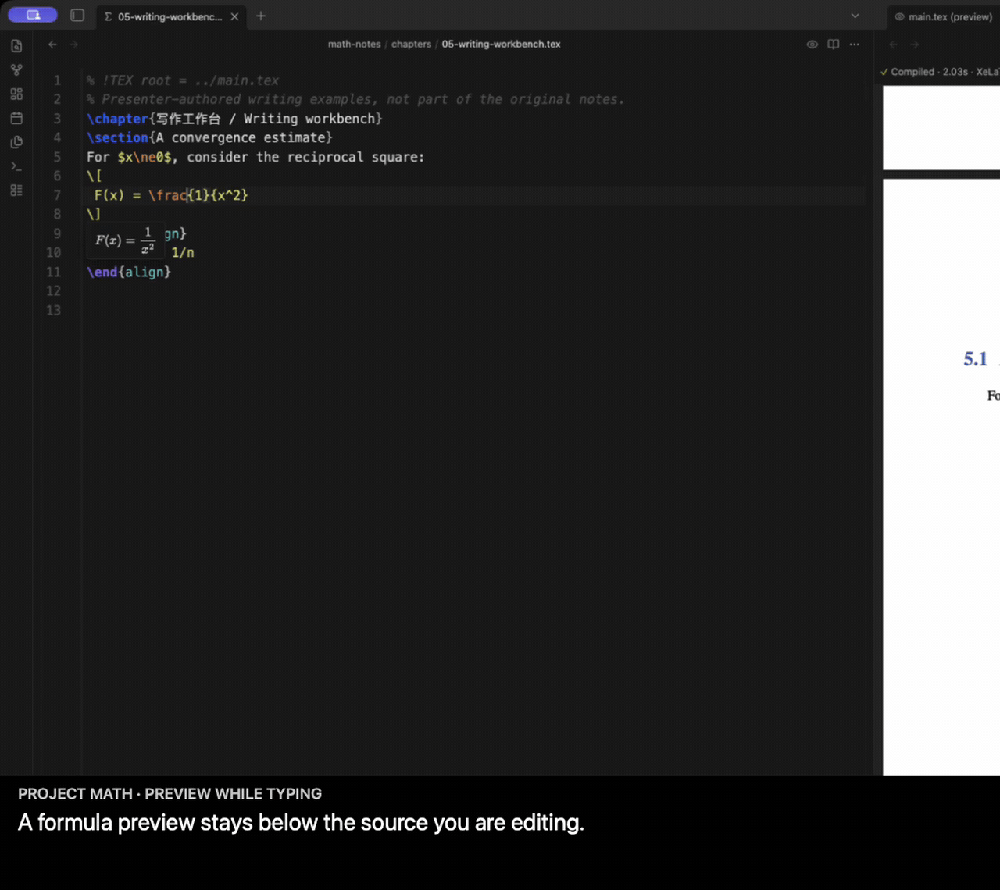

### Write commands and environments with fewer keystrokes

texlab supplies completion and snippets. Tab moves through fields; Enter continues environments and lists. The shared key handling keeps completion, snippets and optional ghost text working together.

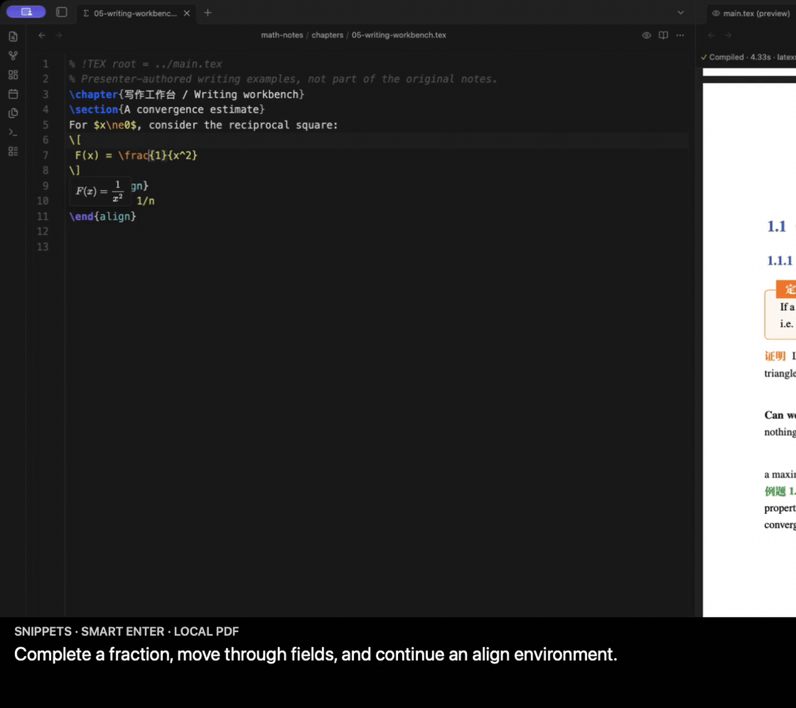

### Add your preferred AI completion

With the separately installed [YOLO](https://github.com/Lapis0x0/obsidian-yolo) plugin, use real ghost-text suggestions in the LaTeX editor. Tab accepts a suggestion; Enter remains a writing key. Undo restores the source. This clip starts after generation and makes no model-speed claim.

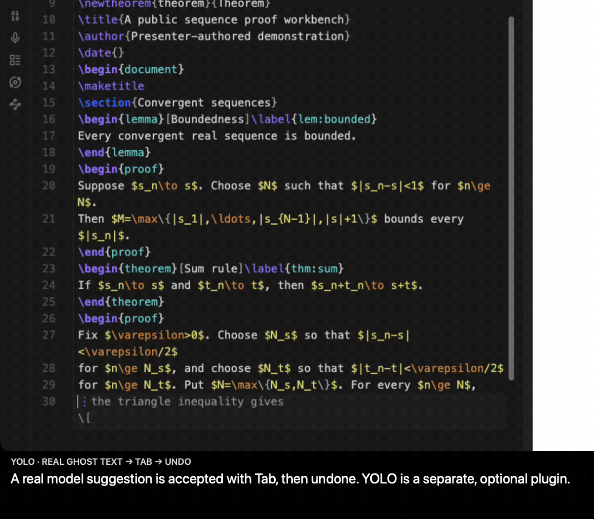

### Read TeX graphics in the editor

Supported TikZ and table blocks can display a crop of the actual compiled PDF. Keep the real TeX drawing beside the surrounding mathematics.

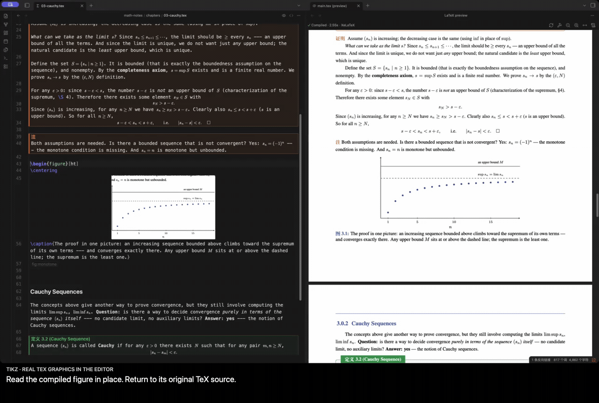

### Correct an error and continue

Real TeX diagnostics reach the source editor. The PDF remains available while you fix the source; the build dock keeps controls and diagnostics above its scrolling viewport.

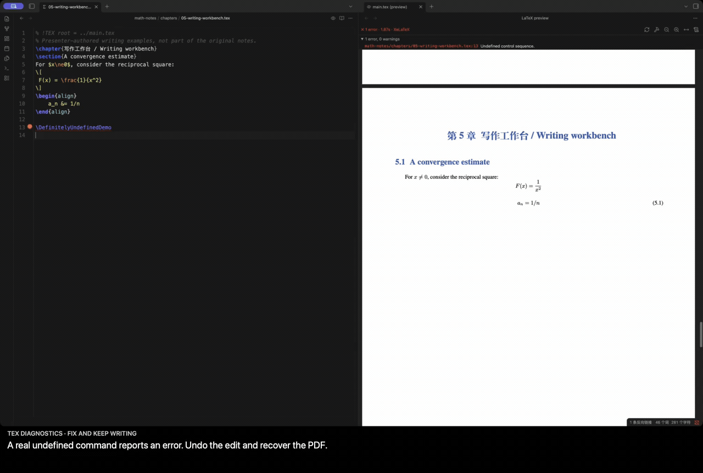

### Share a portable reading edition

Export a self-contained HTML page with math, theorem blocks, references, bibliography, images and supported SVG graphics. Follow its references and table of contents without Obsidian; inspect the export report for unsupported content.

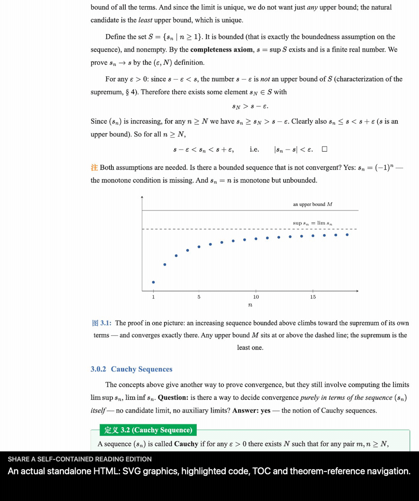

### Watch the compilation itself

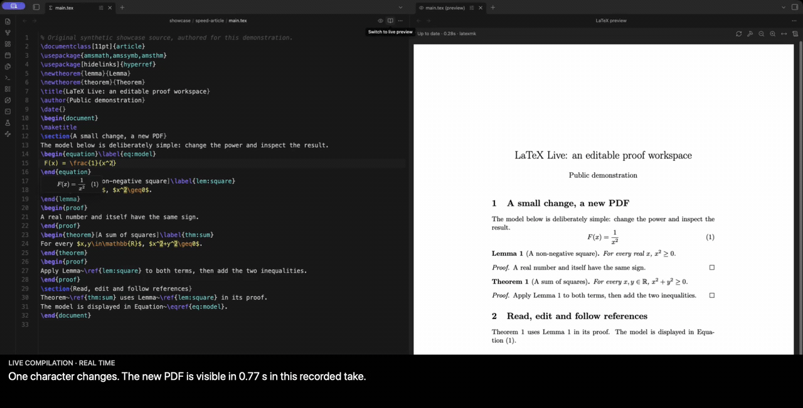

</details>

All GIFs are excerpts of real applications at normal speed. Some focus on fixed detail crops; template montages contain explicitly separated takes. Chinese-captioned versions are in the [Chinese README](./README_zh-CN.md). See [recording provenance](./docs/demo/showcase-provenance.json).

## How it compares with Overleaf

The advantages shown here are the connected reading and writing workflow: template-aware in-place editing, project-aware math previews, a deterministic proof-reference window, composable editor tools, and a portable mathematical reading edition.

Overleaf also offers [automatic compilation](https://docs.overleaf.com/getting-started/recompiling-your-project), [bidirectional SyncTeX](https://docs.overleaf.com/navigating-in-the-editor/working-with-the-pdf-viewer/moving-between-the-editor-and-pdf), [AI tools](https://docs.overleaf.com/integrations-and-add-ons/ai-features) and [HTML conversion](https://docs.overleaf.com/managing-projects-and-files/importing-and-exporting-files). Its integrated collaboration, comments and review workflow matter for coauthored papers. Read the [full comparison](./docs/demo/overleaf-comparison.en.md), including the measured same-source example and the capabilities we have not compared experimentally.

## Quick start

1. Install **Obsidian 1.13.7 or later on desktop** and a local TeX distribution such as [TeX Live](https://www.tug.org/texlive/) or [MacTeX](https://www.tug.org/mactex/).
2. Install and enable LaTeX Live using the release instructions below.
3. Put a `.tex` project inside your vault and open it. Use the eye action in the editor header to open the PDF preview.
4. Edit and save. The default typing delay is 400 ms before saving and requesting a compile; it is not the time required to generate a PDF.
5. Switch the editor mode from its header or run **LaTeX Live: Toggle live preview**. Use **LaTeX Live: Full build with latexmk (BibTeX/Biber, all passes)** when a complete build is needed.

For enhanced editing, install [texlab](https://github.com/latex-lsp/texlab) separately. Configure **TeX binary directory** and **texlab binary** in plugin settings if automatic detection does not find them.

## Installation

### Community directory

Open the [LaTeX Live community listing](https://community.obsidian.md/plugins/latex-live), choose **Add to Obsidian**, then enable **LaTeX Live**.

### Manual installation

1. Download `main.js`, `manifest.json` and `styles.css` from the same [GitHub Release](https://github.com/qiulinfan/obsidian-latex-live/releases).
2. Put them in `<vault>/.obsidian/plugins/latex-live/`.
3. Reload Obsidian, then enable **LaTeX Live** under Settings → Community plugins.

The plugin does not download, install or update TeX, texlab, bibliography processors or other dependencies.

## Projects and templates

Keep the original project structure, including `\input`, `\include`, bibliography and local packages. A chapter can identify its main document with a magic comment:

```tex
% !TEX root = ../main.tex
```

An engine comment such as `% !TEX program = xelatex` takes precedence over the default engine setting. Automatic detection also reads the preamble and latexmk configuration.

PDF layout belongs to the original class and TeX toolchain. Tested examples include ElegantBook and PLOS, Springer Nature, REVTeX, AASTeX, AMS, LNCS, ACM and IEEE paper templates. This is a tested set, not a promise that every template or package has full live-editor/HTML semantics. See [template compatibility](./docs/template-compatibility.md).

## Export a reading edition

Run **LaTeX Live: Export to HTML**, choose a destination and inspect **Report** when export finishes. The page embeds its supported math fonts, images and SVG resources and requires no JavaScript for reading.

The current HTML exporter supports **pdfLaTeX and XeLaTeX**. LuaLaTeX remains available for PDF compilation, but HTML export is outside its current support scope. Complex constructs may be represented as SVG or source; the report makes those boundaries visible. A reading edition does not reproduce every journal's printed page layout.

## Local files, processes and network

- Compilation, PDF preview and language assistance use local processes. TeX, texlab, packages and fonts are separately installed software with their own behavior and licenses.
- The plugin reads project inputs and dependencies, finds configured/system binaries and writes build files under an operating-system temporary directory outside the vault. Packages, fonts, bibliography files and other TeX dependencies may also live outside the vault; these accesses support normal local compilation.
- Math and PDF rendering use Obsidian's bundled MathJax and pdf.js resources. The plugin has no built-in remote AI service or client telemetry.
- Optional YOLO completion is **off by default**. Enabling it uses the separate YOLO plugin, which can send writing context to its configured model provider. Review YOLO's configuration and the provider's policies before enabling it.
- Shell escape is **off by default**. Enabling it lets trusted TeX documents execute commands through the installed toolchain.

Desktop only; this release does not provide iPad editing. Source files remain ordinary LaTeX files that other editors and tools can use.

## Feedback and contributing

[Report a bug or suggest a feature](https://github.com/qiulinfan/obsidian-latex-live/issues). Include your Obsidian/plugin version, OS, TeX engine and a small reproducible project. Remove private notes, keys and unrelated files before attaching material.

Contributions are welcome. For large changes, open an issue first to discuss the use case and implementation. Development guidance is in [AGENTS.md](./AGENTS.md).

## Acknowledgments and license

Built around Obsidian, CodeMirror, texlab, MathJax, pdf.js and the TeX ecosystem. Optional AI completion is supplied by [YOLO](https://github.com/Lapis0x0/obsidian-yolo).

Math-note excerpts were adapted with the author's permission from [Onion20040508/notes](https://github.com/Onion20040508/notes). The source attribution and original terms are retained; the comparison fixture and new short template examples are original demonstration material.

The project's own software and authored documentation use [MIT](./LICENSE): commercial use, modification and closed-source distribution are permitted with the copyright and permission notices retained. Third-party software, fonts and referenced materials retain their original licenses; see [third-party notices](./THIRD_PARTY_NOTICES.md).
