<h1 align="center">LaTeX Live</h1>
<p align="center">在 Obsidian 中实时读写数学：模板编辑、快速编译、双向跳转与 AI 补全。</p>

<p align="center">
  <a href="https://github.com/qiulinfan/obsidian-latex-live/commits/main"></a>
  <a href="https://github.com/qiulinfan/obsidian-latex-live/stargazers"></a>
  <a href="https://github.com/qiulinfan/obsidian-latex-live/releases/latest"></a>
  <a href="./LICENSE"></a>
  
</p>

<p align="center"><a href="./README.md">English</a> | <b>简体中文</b></p>

## 把 ElegantBook 变成实时数学编辑器

**公式、编号定理框、证明和引用，直接读写。** 在实时编辑模式中编辑数学，右侧保留 ElegantBook 原生排版的 PDF。进入公式时显示它的 TeX，离开后恢复渲染；需要时，也可以让整个编辑器在实时编辑与源码模式间切换。

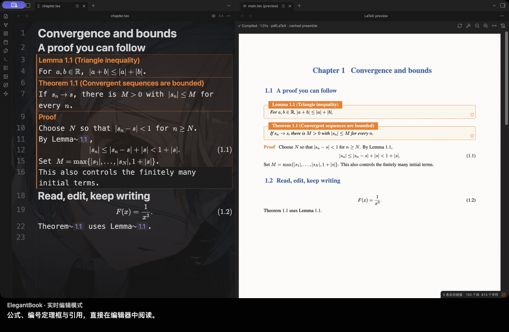

[查看 Retina 分辨率高清录屏](./docs/assets/showcase/elegantbook-clear-zh.mp4)。

工程始终是普通 `.tex` 文件。公式使用项目宏，定理标题遵循模板，引用芯片显示实际编译得到的编号。

## 快速编译，源码与 PDF 双向跳转

修改公式，查看原生 PDF 更新。从光标直接定位排版结果，再双击 PDF 回到对应源码行；多文件项目也能沿章节跳转。

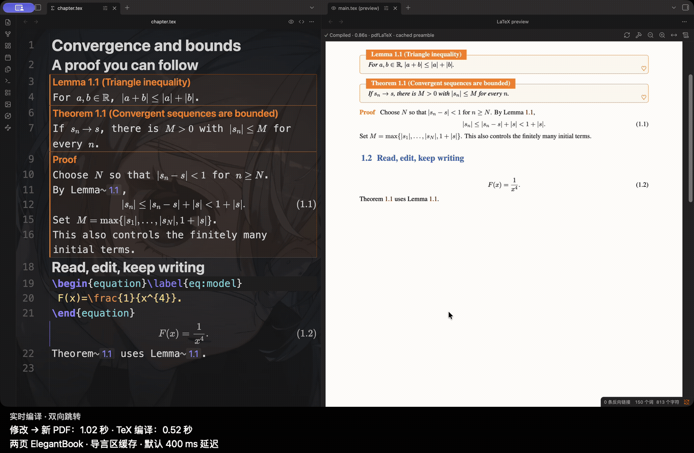

[查看 Retina 分辨率高清录屏](./docs/assets/showcase/speed-navigation-clear-zh.mp4)。

这次两页 ElegantBook 的修改到新 PDF 为 **1.02 秒**，包含默认 400 ms 延迟；导言区缓存后的 TeX 编译为 **0.52 秒**。下方另有真实 Overleaf 同稿对比：本次测量中，LaTeX Live 的 PDF 等待时间缩短约 **76%–79%**。详见[录制说明](./docs/demo/clear-showcase.md)。

## YOLO + Mercury Edit 2，边写边补全

在实时编辑的证明里继续写作。单独安装的 [YOLO](https://github.com/Lapis0x0/obsidian-yolo) 提供所配置模型的 ghost text 补全，这次展示的是 **Mercury Edit 2**。按 Tab 接受到正文，撤销还原原稿；Enter 继续正常写作。

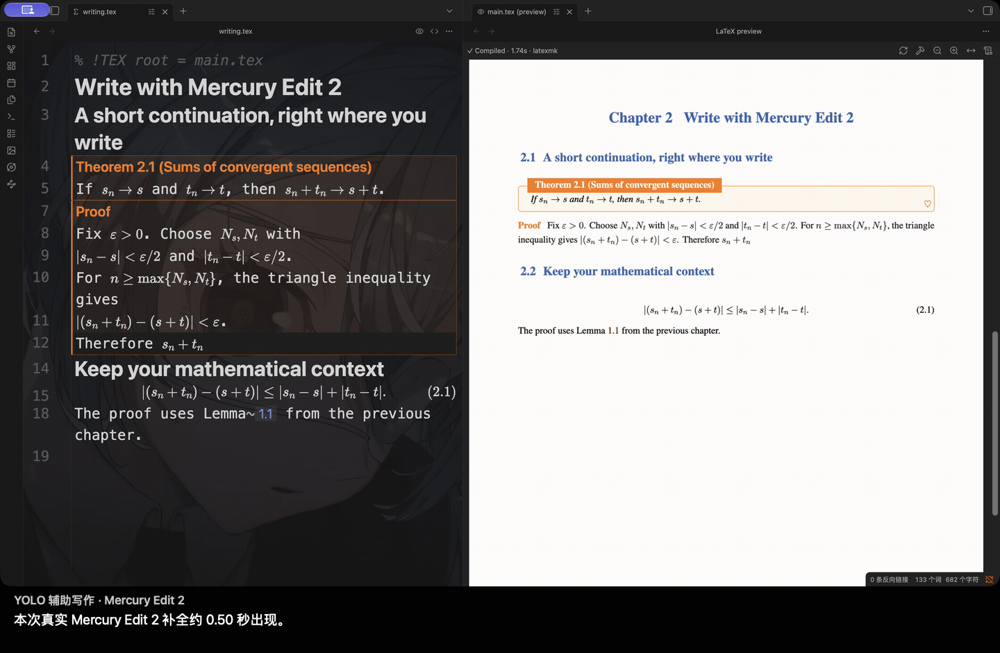

[查看 Retina 分辨率高清录屏](./docs/assets/showcase/mercury-edit2-writing-zh.mp4)。

本次简短数学结论的真实补全约 **0.50 秒**出现。片段保留模型请求的实际等待与正常播放速度，剪辑省略审阅建议时的停顿。详见[源码与计时证据](./docs/demo/clear-showcase.md)。

## 个人数学写作，省下等待和来回查找

相对于只在 Overleaf 中写作，LaTeX Live 把日常最常用的环节连在一起：

- **更快获得 PDF 反馈。** 同一份一页源码，三次热编辑：LaTeX Live 0.1.1 中位数约 **0.87 秒**，Overleaf 云端免费账户的中位数观测区间约 **3.7–4.1 秒**，本次响应速度约为 **4.2–4.7 倍**。
- **编辑时直接读数学。** 模板定理框、项目宏和局部源码展开，让修改时仍能看清论证。
- **就地追溯证明引用。** 小窗打开引用图，展开陈述与证明，沿论证继续阅读。
- **自己选择增强工具。** texlab 补全与诊断、YOLO、喜欢的模型、普通文件和 Git 可以配合使用。
- **分享完整的数学阅读版。** 自包含 HTML 保留资源、定理结构、编号和引用链接。

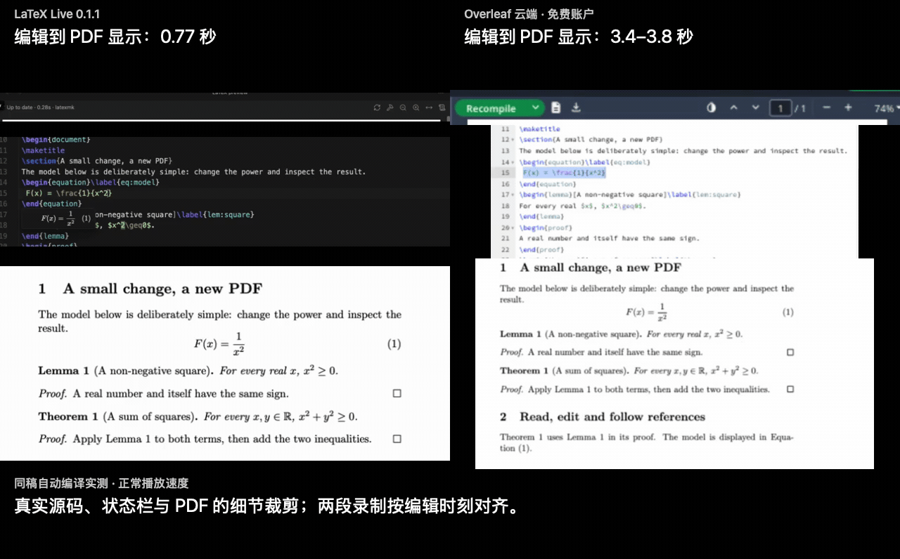

两边均使用 pdfLaTeX / TeX Live 2026，本地时间包含默认 400 ms 延迟和导言区缓存。数字对应本次机器、账户与文档；[源码、全部样本与方法](./docs/demo/same-source-speed.md)均已保留。LaTeX Live 目前侧重个人写作，尚不提供多人实时协作；详见[完整对比](./docs/demo/overleaf-comparison.md)。

## 悬浮引用，沿证明继续阅读

悬浮定理引用，在小窗查看证明引用图。点击节点，展开该定理的陈述和证明；可以继续沿引用浏览，也可以直接打开对应源文件位置。

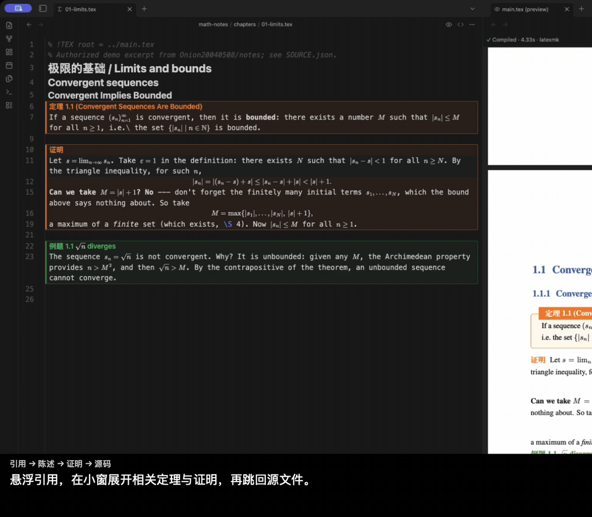

图中的关系来自当前 LaTeX 项目证明里的字面 `\ref`，表示明确写出的证明引用关系，不是经过逻辑验证的定理依赖。

## 不同模板，同一条编辑流程

保留原来的 `.tex` 工程和文档类。公式、带编号的定理框和引用就地显示；光标进入公式时恢复源码，改完继续阅读。PDF 仍由原模板排版。

ElegantBook 只是其中一种。**AMS、IEEE** 论文类也录下了相同的编辑流程；模板画廊还展示了生物领域的 **PLOS** 和物理领域的 **REVTeX**。已测试的模板还包括 Springer Nature、AASTeX、LNCS 和 ACM。未支持的构造保留源码，或使用支持范围内的 TeX/PDF 回退。详见[模板兼容范围](./docs/template-compatibility.md)。

<details>
<summary>展开查看 AMS / IEEE 编辑，以及 PLOS / REVTeX 阅读模式</summary>

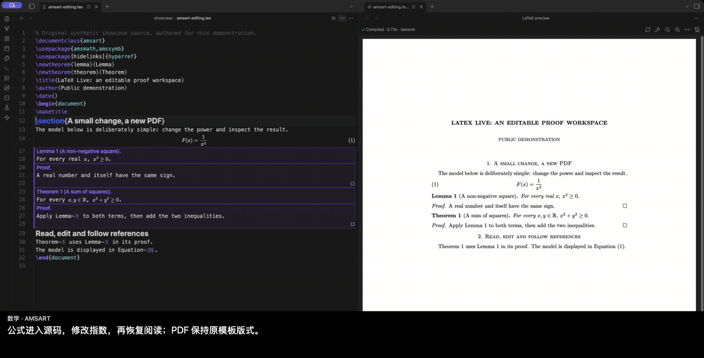

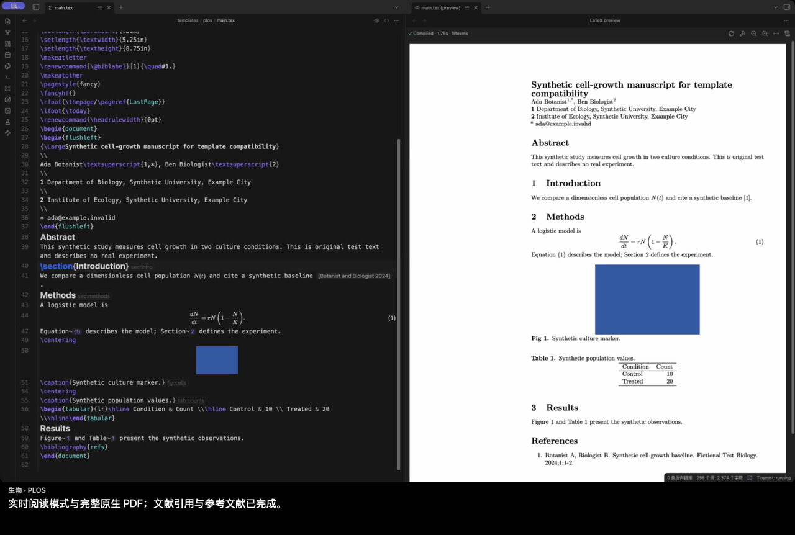

AMS / IEEE 片段包含实际修改；PLOS / REVTeX 展示完成全文构建后的实时阅读模式，属于模板展示，不是冷编译基准。

</details>

## 分享可独立阅读的 HTML

导出自包含 HTML，保留数学、定理框、引用、文献、图片与支持范围内的 SVG 图形。读者无需 Obsidian 就能沿引用和目录跳转；导出报告列出未支持的内容。

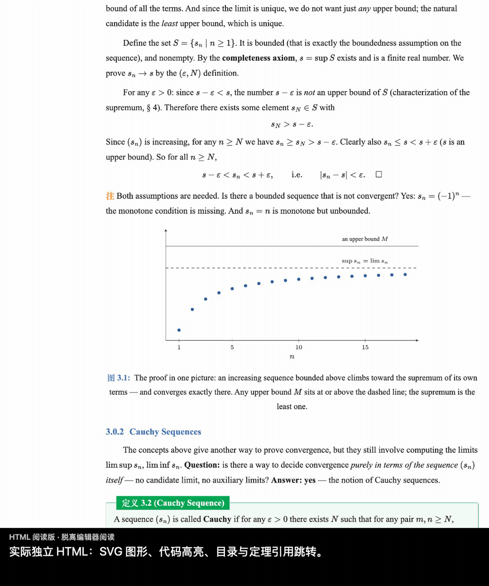

## 更多写作细节

<details>
<summary>公式预览、补全与占位符、TeX 图形、诊断和实时编译</summary>

### 写公式时，就能看到公式

悬浮与光标预览使用项目宏和公式编号。数学的即时显示与完整 PDF 编译分别进行。

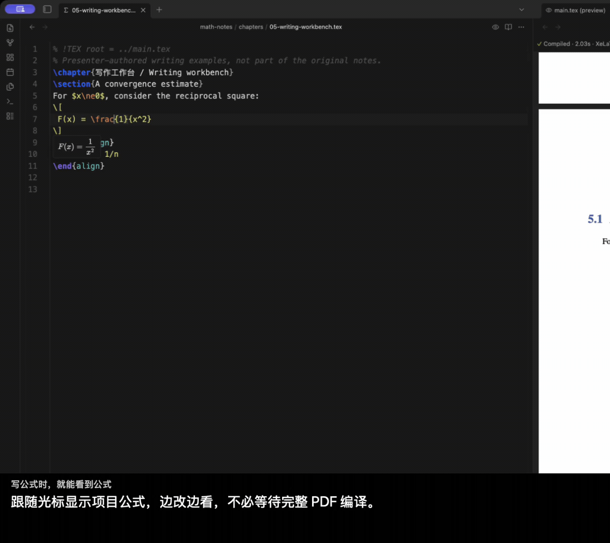

### 少敲几次按键

texlab 提供命令补全与 snippet。Tab 在占位符间移动，Enter 续写环境和列表；统一的按键处理让补全、占位符与可选 AI 建议协同工作。

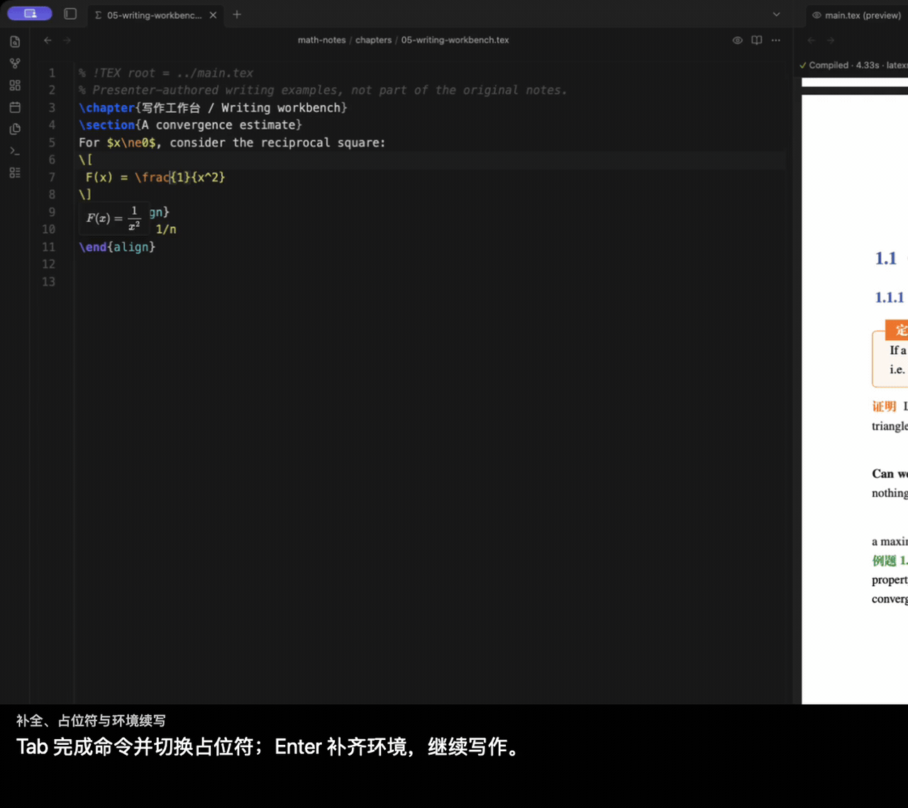

### 在编辑器里读 TeX 图形

支持范围内的 TikZ 和表格可显示实际编译 PDF 的裁剪，让图形与周围的数学内容一起阅读。

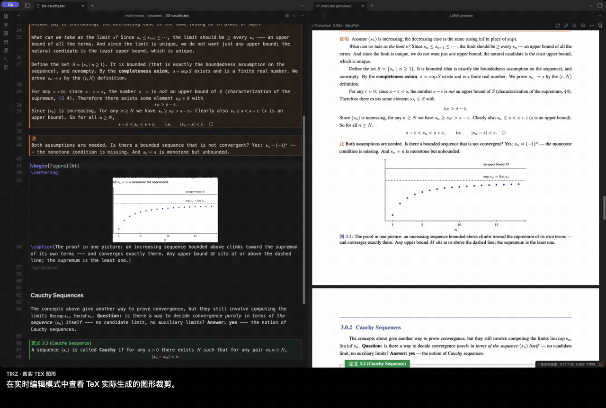

### 修复错误，继续写作

真实 TeX 诊断回到源码编辑器；修复期间保留已有 PDF。构建控件和诊断放在滚动 PDF 上方的独立区域。

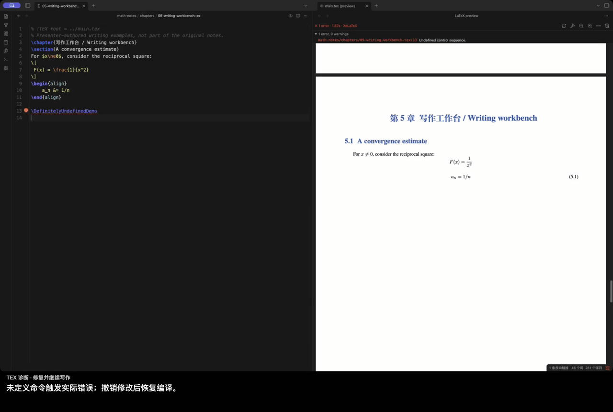

### 直接看一次实时编译

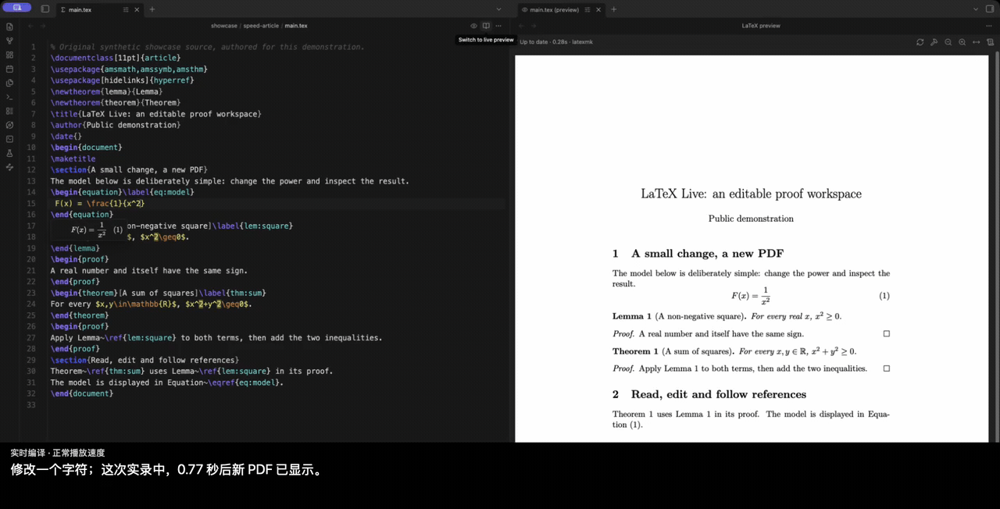

</details>

所有 GIF 都截取自真实应用，并按正常速度播放；前三项另有上方链接的 Retina 分辨率视频。部分其他片段使用固定细节裁剪，剪辑省略场景间的停顿。英文字幕版本位于[英文 README](./README.md)。[录制来源与收据](./docs/demo/showcase-provenance.json)可供核对。

## 快速开始

1. 安装桌面版 **Obsidian 1.13.7 或更新版本**，以及 [TeX Live](https://www.tug.org/texlive/)、[MacTeX](https://www.tug.org/mactex/) 等本机 TeX 发行版。
2. 按下面的安装说明启用 LaTeX Live。
3. 将 `.tex` 项目放进 vault，打开文件，点击标题栏的 **Switch to live preview**，进入实时编辑模式，开始阅读和修改就地显示的数学内容。
4. 点击预览图标打开 PDF，再编辑并保存。默认停键 400 ms 后保存并请求编译；这不是 PDF 的生成耗时。
5. 需要时，通过标题栏或 **LaTeX Live: Toggle live preview** 切回源码。处理文献或完整构建时，执行 **LaTeX Live: Full build with latexmk (BibTeX/Biber, all passes)**。

需要增强编辑功能时，另行安装 [texlab](https://github.com/latex-lsp/texlab)。如果自动检测找不到程序，在设置里填写 **TeX binary directory** 和 **texlab binary**。

## 安装

### 社区目录

打开 [LaTeX Live 社区页面](https://community.obsidian.md/plugins/latex-live)，点击 **Add to Obsidian**，然后启用 **LaTeX Live**。

### 手动安装

1. 从同一个 [GitHub Release](https://github.com/qiulinfan/obsidian-latex-live/releases) 下载 `main.js`、`manifest.json`、`styles.css`。
2. 放入 `<vault>/.obsidian/plugins/latex-live/`。
3. 重载 Obsidian，然后在设置 → 社区插件中启用 **LaTeX Live**。

插件不会下载、安装或升级 TeX、texlab、文献处理器等依赖。

## 多文件项目与模板

保留原项目的 `\input`、`\include`、文献和本地宏包结构。章节可以通过注释指定主文档：

```tex
% !TEX root = ../main.tex
```

`% !TEX program = xelatex` 等引擎注释优先于默认引擎设置；自动检测也会读取导言区与 latexmk 配置。

PDF 版式由原来的 class 和 TeX 工具链决定。已测试的例子包括 ElegantBook，以及 PLOS、Springer Nature、REVTeX、AASTeX、AMS、LNCS、ACM、IEEE 论文模板。这是已测试范围，不代表所有模板和宏包都具备完整的实时编辑或 HTML 语义支持。详见[模板兼容说明](./docs/template-compatibility.md)。

## 导出阅读版

执行 **LaTeX Live: Export to HTML**，选择保存位置；完成后可点击 **Report** 查看报告。阅读页内嵌支持的数学字体、图片和 SVG，不依赖 JavaScript 阅读。

目前 HTML 导出支持 **pdfLaTeX 和 XeLaTeX**。LuaLaTeX 可以编译 PDF，但尚不支持 HTML 导出。复杂构造可能显示为 SVG 或源码，报告会记录支持边界；阅读版也不会复现每一种期刊的印刷布局。

## 本地文件、进程和网络

- 编译、PDF 预览和语言辅助调用本机进程。TeX、texlab、宏包和字体都是独立安装的软件，各自遵循其行为与许可证。
- 插件读取项目输入和依赖、查找配置或系统中的程序，并将构建文件写到 vault 外的系统临时目录。宏包、字体、文献文件等 TeX 依赖也可能位于 vault 外；这些访问用于正常的本机编译。
- 数学和 PDF 渲染使用 Obsidian 自带的 MathJax、pdf.js 资源。插件没有内置远程 AI 服务或客户端遥测。
- YOLO 补全**默认关闭**。启用后，独立 YOLO 插件可能向其配置的模型服务发送写作上下文；请先检查 YOLO 配置及该服务的政策。
- Shell escape **默认关闭**。启用后，受信任的 TeX 文档可以通过已安装的工具链执行命令。

仅支持桌面端，本版不提供 iPad 编辑。源码仍是普通 LaTeX 文件，可以交给其他编辑器和工具使用。

## 反馈与贡献

欢迎[反馈问题或功能建议](https://github.com/qiulinfan/obsidian-latex-live/issues)。请提供 Obsidian／插件版本、操作系统、TeX 引擎和最小复现项目；附件中请移除私人笔记、密钥和无关文件。

较大的功能改动请先通过 issue 讨论使用场景和实现方式。开发说明见 [AGENTS.md](./AGENTS.md)。

## 致谢与许可证

基于 Obsidian、CodeMirror、texlab、MathJax、pdf.js 和 TeX 生态，可选 AI 补全由 [YOLO](https://github.com/Lapis0x0/obsidian-yolo) 提供。

数学笔记片段经原作者授权，改编自 [Onion20040508/notes](https://github.com/Onion20040508/notes)，保留来源署名和原有条款；同稿对比与新录制的短模板例子为原创演示材料。

项目自行拥有的软件与文档使用 [MIT](./LICENSE)：允许商用、修改和闭源分发，须保留版权与许可声明。第三方软件、字体和引用材料继续遵循各自原有许可证，详见[第三方通知](./THIRD_PARTY_NOTICES.md)。
