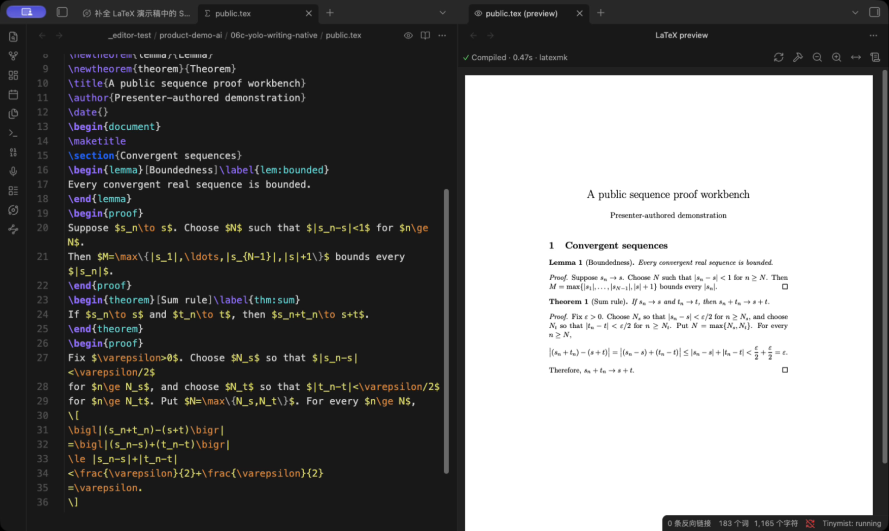

<h1 align="center">LaTeX Live</h1>
<p align="center">在 Obsidian 中读写原生 LaTeX 项目，就地查看公式、证明引用和真实 PDF。</p>

<p align="center">
  <a href="https://github.com/qiulinfan/obsidian-latex-live/commits/main"></a>
  <a href="https://github.com/qiulinfan/obsidian-latex-live/stargazers"></a>
  <a href="https://github.com/qiulinfan/obsidian-latex-live/releases/latest"></a>
  <a href="./LICENSE"></a>
  
</p>

<p align="center"><a href="./README.md">English</a> | <b>简体中文</b></p>

## 主要体验



直接使用原来的 `.tex` 文件。在编辑器里阅读支持的公式和定理框，编辑时展开源码，再用本机 TeX 生成的 PDF 核对结果。

悬停定理引用，可以打开当前项目的证明引用图，点击节点查看陈述和证明，并跳回源行。需要方便阅读和分享的版本时，可以导出自包含 HTML。

## 功能

| 功能 | 用途 |
| --- | --- |
| 源码与实时编辑 | 就地显示支持的数学、标题、列表、定理框、图片和引用芯片，并保留可编辑源码。 |
| 真实 PDF 预览 | 调用已安装的 pdfLaTeX、XeLaTeX 或 LuaLaTeX；通过 latexmk 完成文献与多轮构建。 |
| 双向 SyncTeX | 将光标定位到 PDF，双击 PDF 返回源码，支持多文件项目。 |
| 语言辅助 | 接入独立安装的 texlab，提供补全、snippet、诊断和悬停信息。 |
| 公式预览 | 使用项目宏显示悬停公式，可选光标预览以及支持范围内的 TeX/PDF 回退。 |
| 证明引用图 | 根据证明正文中的字面 `\ref` 建图，展开陈述与证明，打开源文件位置。 |
| HTML 导出 | 输出章节、数学、定理框、引用、文献、内嵌资源和支持的图形，并提供导出报告。 |
| 可选 YOLO 补全 | 使用独立 YOLO 插件的真实 ghost 候选；Tab 接受，Enter 不接受 AI 文本。 |

引用图表示源码中的显式证明引用，不代表经过机器验证的逻辑依赖。未知环境和不支持的宏保留源码，或使用支持的回退方式。

## 快速开始

1. 安装桌面版 **Obsidian 1.13.7 或更新版本**，以及 [TeX Live](https://www.tug.org/texlive/)、[MacTeX](https://www.tug.org/mactex/) 等本机 TeX 发行版。
2. 按下面的安装说明启用 LaTeX Live。
3. 将 `.tex` 项目放进 vault，打开文件，点击编辑器标题栏的预览图标。
4. 编辑并保存。默认停键 400 ms 后保存并请求编译；这不是 PDF 的生成耗时。
5. 使用标题栏按钮或 **LaTeX Live: Toggle live preview** 切换编辑模式。需要完整构建时，执行 **LaTeX Live: Full build with latexmk (BibTeX/Biber, all passes)**。

需要增强编辑功能时，另行安装 [texlab](https://github.com/latex-lsp/texlab)。如果自动检测找不到程序，在设置里填写 **TeX binary directory** 和 **texlab binary**。

## 安装

### 社区目录

上架后可使用[社区插件页面](https://community.obsidian.md/plugins/latex-live)。首次审核期间，可从 GitHub Release 手动安装。

### 手动安装

1. 从同一个 [GitHub Release](https://github.com/qiulinfan/obsidian-latex-live/releases) 下载 `main.js`、`manifest.json`、`styles.css`。
2. 放入 `<vault>/.obsidian/plugins/latex-live/`。
3. 重载 Obsidian，然后在设置 → 社区插件中启用 **LaTeX Live**。

插件不会下载、安装或升级 TeX、texlab、文献处理器等依赖。

## 多文件项目与模板

保留原项目的 `\input`、`\include`、文献和本地宏包结构。章节可以通过注释指定主文档：

```tex
% !TEX root = ../main.tex
```

`% !TEX program = xelatex` 等引擎注释优先于默认引擎设置；自动检测也会读取导言区与 latexmk 配置。

PDF 版式由原来的 class 和 TeX 工具链决定。已测试的例子包括 ElegantBook，以及 PLOS、Springer Nature、REVTeX、AASTeX、AMS、LNCS、ACM、IEEE 论文模板。这是已测试范围，不代表所有模板和宏包都具备完整的实时编辑或 HTML 语义支持。详见[模板兼容说明](./docs/template-compatibility.md)。

## 导出阅读版

执行 **LaTeX Live: Export to HTML**，选择保存位置；完成后可点击 **Report** 查看报告。阅读页内嵌支持的数学字体、图片和 SVG，不依赖 JavaScript 阅读。

目前 HTML 导出支持 **pdfLaTeX 和 XeLaTeX**。LuaLaTeX 可以编译 PDF，但尚不支持 HTML 导出。复杂构造可能显示为 SVG 或源码，报告会记录支持边界；阅读版也不会复现每一种期刊的印刷布局。

## 本地文件、进程和网络

- 编译、PDF 预览和语言辅助调用本机进程。TeX、texlab、宏包和字体都是独立安装的软件，各自遵循其行为与许可证。
- 插件读取项目输入和依赖、查找配置或系统中的程序，并将构建文件写到 vault 外的系统临时目录。宏包、字体、文献文件等 TeX 依赖也可能位于 vault 外；这些访问用于正常的本机编译。
- 数学和 PDF 渲染使用 Obsidian 自带的 MathJax、pdf.js 资源。插件没有内置远程 AI 服务或客户端遥测。
- YOLO 补全**默认关闭**。启用后，独立 YOLO 插件可能向其配置的模型服务发送写作上下文；请先检查 YOLO 配置及该服务的政策。
- Shell escape **默认关闭**。启用后，受信任的 TeX 文档可以通过已安装的工具链执行命令。

仅支持桌面端，本版不提供 iPad 编辑。源码仍是普通 LaTeX 文件，可以交给其他编辑器和工具使用。

## 反馈与贡献

欢迎[反馈问题或功能建议](https://github.com/qiulinfan/obsidian-latex-live/issues)。请提供 Obsidian／插件版本、操作系统、TeX 引擎和最小复现项目；附件中请移除私人笔记、密钥和无关文件。

较大的功能改动请先通过 issue 讨论使用场景和实现方式。开发说明见 [AGENTS.md](./AGENTS.md)。

## 致谢与许可证

基于 Obsidian、CodeMirror、texlab、MathJax、pdf.js 和 TeX 生态，可选 AI 补全由 [YOLO](https://github.com/Lapis0x0/obsidian-yolo) 提供。

项目自行拥有的软件与文档使用 [MIT No Attribution（MIT-0）](./LICENSE)：允许商用、修改和闭源分发，不附带署名条件。第三方软件、字体和引用材料继续遵循各自原有许可证，详见[第三方通知](./THIRD_PARTY_NOTICES.md)。
